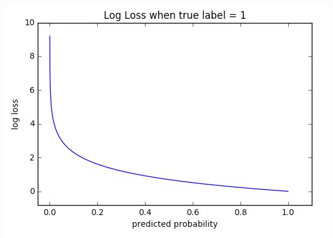

OHEM means Online Hard Example Mining. More details are [here](http://www.erogol.com/online-hard-example-mining-pytorch/)

Essentially, it only backpropagates the largest losses (tunable) in each minibatch when training, the idea being that easy examples with low loss don't really contribute to learning. So I choose alpha = 0.1. If you change to other loss, please tune alpha to proper value.
